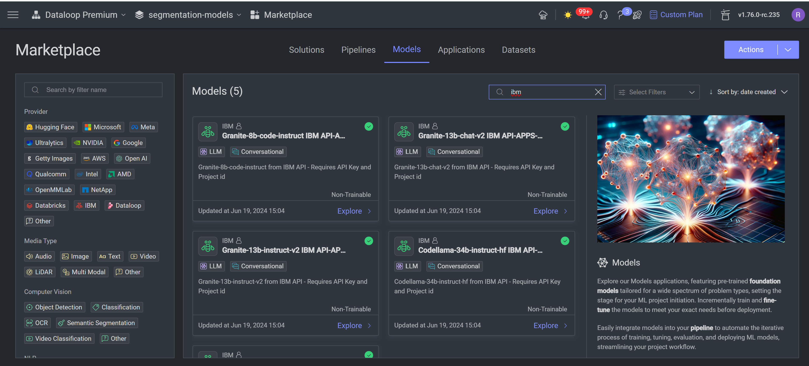
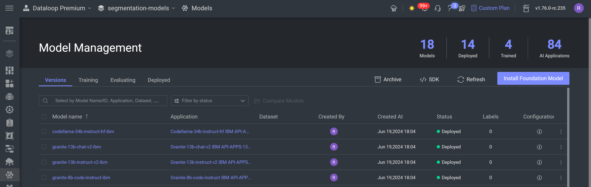

# IBM Watsonx as a Service - Model Adapters

This repository contains the code for Dataloop model adapters that invoke models served in IBM via their API.
To use this model adapter, it is needed to have a project in IBM and an API key.

More information on IBM Watsonx as a Service can be
found [here](https://dataplatform.cloud.ibm.com/docs/content/wsj/getting-started/welcome-main.html?context=wx&audience=wdp).

## Overview

The adapters in this repository are designed to interface with IBM models served via API endpoints. These adapters
facilitate seamless integration and interaction with IBM's machine learning models.

To use thie models in Dataloop Platform you'll need the following:

1. **Dataloop Account**
2. **IBM Cloud Account**: Access to IBM Cloud services is required to deploy and manage these models.
3. **API Key**: Can be created in your IBM Account.
4. **Project id** : A valid id of a project in your IBM account.

## In Dataloop Platform

Once you have an API key and a Url you can access and get a response from your model in Dataloop platform.

### 1. Install the model from Dataloop Marketplace

Go to Marketplace, Models tab, and search for the requested model (IBM and Model's name) and install:

### 2. Edit the Region-url and Project-id in the model's configuration

#### 2.1 On model's configuration edit `project-id` and `region`:

Navigate to Model management tab, and click on the installed model:

Insert your `project-id`.

Insert your url in `region` and click `Save`.

#### 2.2 On Data Governance tab, add your API key:

1. Click on create integration and choose `create secret`

2. Choose a `secret name` an insert your API key.

### 3. Add secret name to the service

* In your pipeline, click on the Model node and choose `edit service configuration`

* In `init inputs value`, edit `ibm_api_key_name` and insert your secret name. In `Secrets & Integrations` insert
  your secret by choosing from the options list.

After following these steps, you be able to use Azure Serverless API models via Dataloop Platform.